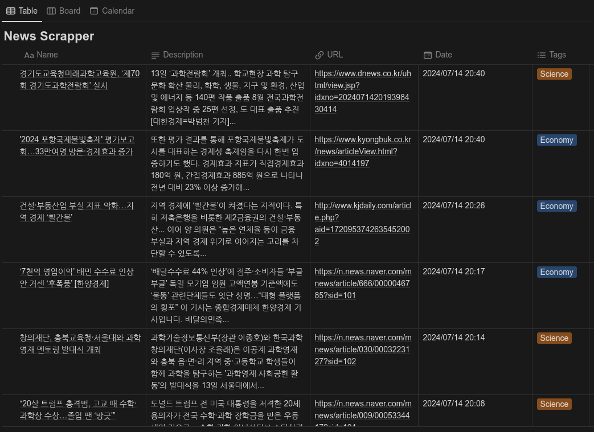
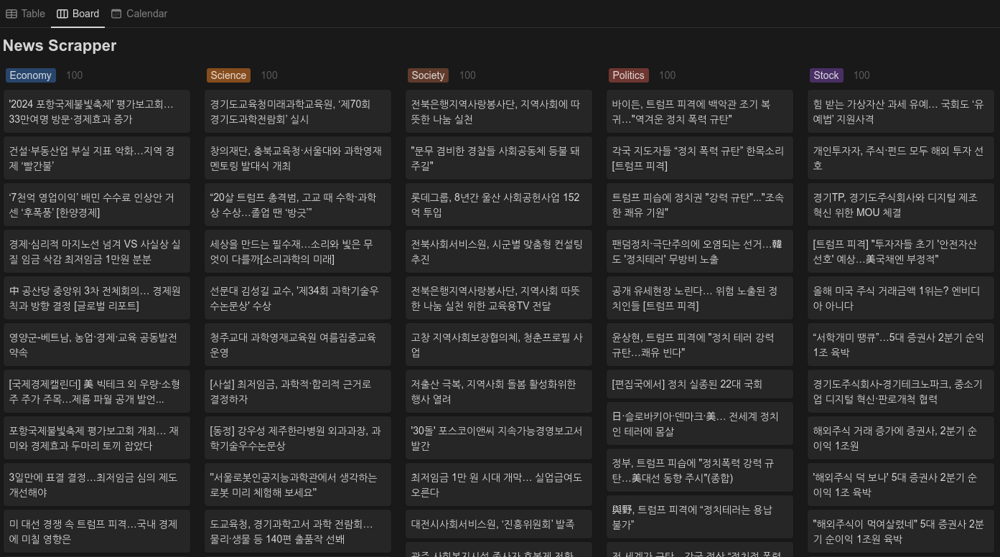
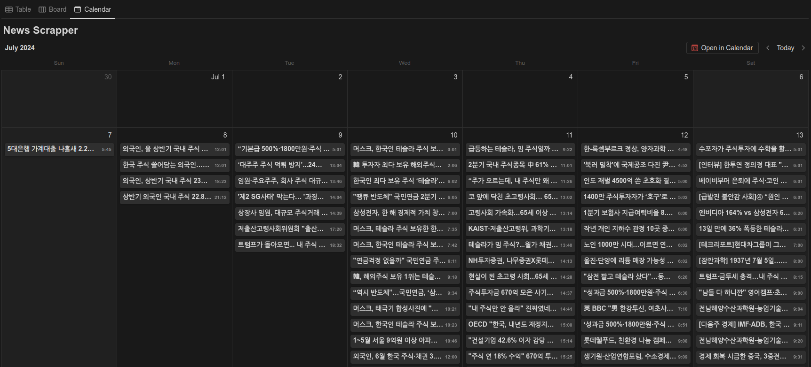

# Notion-News-Crawler

Notion news crawler mecro

## Table of contents

[**1. APIs**](#1-apis)  
[1-1. Environment parameters (`config.py`)](#1-1-environment-parameters-configpy)  
[1-2. Notion API](#1-2-notion-api)  
[1-3. Naver API](#1-3-naver-api)

[**2. Result**](#2-result)

## 1. APIs

### 1-1. Environment parameters (`config.py`)

**`.env` file**

```
# Notion
NOTION_TOKEN
NOTION_DATABASE_ID

# Naver
X_NAVER_CLIENT_ID
X_NAVER_SECRET
```

### 1-2. Notion API

[**Notion API**](https://developers.notion.com/)

```python
self.headers = {
    "Authorization": f"Bearer {self.notion_token}", # notion application token
    "Content-Type": "application/json",
    "Notion-Version": "2022-06-28"                  # latest version of the notion
}
```

### 1-3. Naver API

**Naver API**  
[Naver API application](https://developers.naver.com/apps/#/list)  
[NAVER API docs](https://developers.naver.com/docs/serviceapi/search/news/news.md#%EB%89%B4%EC%8A%A4)

The result of the Naver API

```json
{
    "title": "article title",
    "originallink": "original news link",
    "link": "naver news link",
    "description": "article description",
    "pubDate": "published date"
}
```

---

### 2. Result

**Table view**


**Board view**


**Calendar View**

